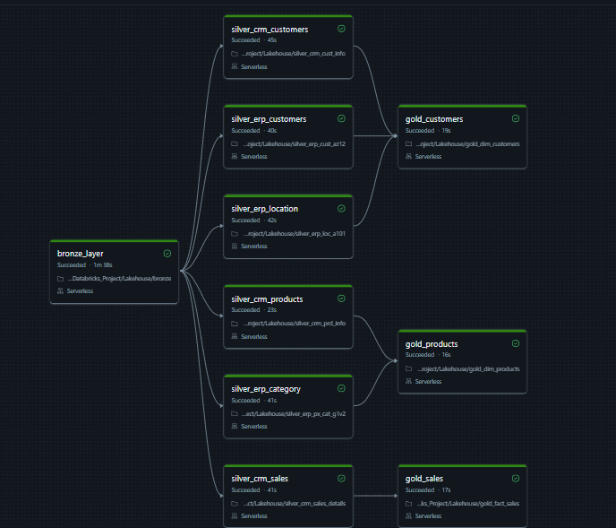
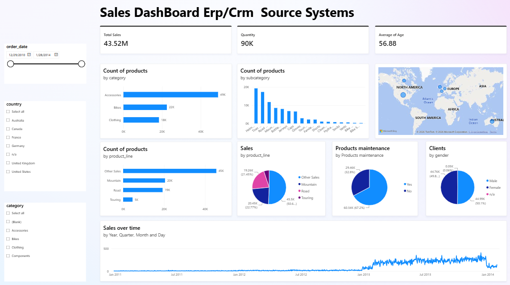

# Databricks Project

## Project Overview
This repository contains an end-to-end data engineering solution built on Databricks. The project ingests raw operational data from disparate enterprise source systems (CRM and ERP), processes it through a multi-tier Medallion Architecture (Bronze, Silver, Gold), builds a BI-ready dimensional model (Star Schema), and exposes clean analytical datasets directly to Power BI for enterprise reporting.

---

## Data Architecture & Flow

* **Source Systems:** Raw CSV files located in storage volumes representing operational CRM and ERP databases.
* **Bronze Layer (Extract & Load):** Direct ingestion into Delta Lake tables, maintaining raw schemas and exact copies of source data.
* **Silver Layer (Cleansing & Standardization):** PySpark transformations including trimming, null handling, data type casting, column renaming, and standardizing categorical fields.
* **Gold Layer (Business Logic & Modeling):** SQL/PySpark joins and window functions building a Star Schema model with fact and dimension tables.
* **Power BI Layer:** Direct connection to Gold Delta tables for enterprise reporting and analytical dashboards.

---

## Data Pipeline Stages

**Source Systems**
* **CRM System:** Captures customer profiles, product catalog metadata, and transactional sales records.
* **ERP System:** Contains supplementary customer demographics, location mappings, and product category hierarchies.

**Bronze Layer (Extract & Load)**
* Ingests raw CSV source files directly into Databricks Delta Lake tables without modifying the original schema or values.
* Serves as an immutable historical record of raw data landings.
* Preserves original source column names, data types, and null records for data auditability.

**Silver Layer (Cleansing & Standardization)**
* Reads raw records from Bronze Delta tables and applies enterprise cleaning rules using PySpark.
* Removes leading and trailing whitespace across string attributes.
* Normalizes categorical data values into standardized formats (e.g., gender and marital status indicators).
* Renames source column names to human-readable enterprise standards.
* Enforces strict data types (converting date strings into native PySpark DateType) and filters out records with null primary keys.

**Gold Layer (Business Logic & Dimensional Modeling)**
* Joins cleansed Silver tables using PySpark and SQL window functions to construct a production Star Schema.
* Generates surrogate keys (`customer_key`) to maintain robust dimensional linking.
* Merges CRM and ERP records using left joins and fallback logic (`COALESCE`) to build unified master records.
* Prepares optimized, aggregated fact and dimension tables tailored for downstream analytical queries.

---

## Data Modeling Strategy

The Gold layer is structured around a **Star Schema** to optimize query execution and simplify BI reporting.

* **Dimension Tables (e.g., `dim_customers`):** Stores unified entity profiles combining core customer attributes from CRM with geographic and demographic details from ERP[cite: 3]. Uses surrogate keys, standardized codes, and consolidated attributes.
* **Fact Tables:** Captures transactional metrics linked directly to primary dimensions via foreign surrogate keys, allowing granular slicing across time, product lines, and customer segments.

---

## Orchestration & Workflow

* **Execution Engine:** Managed via Databricks Workflows (Jobs).
* **Schedule:** Automated daily pipeline runs executing at `00:00 UTC`.
* **Dependency Chain:** Runs sequential tasks ensuring Bronze ingestion finishes before Silver cleansing begins, followed by Gold dimensional modeling.
* **Reliability:** Features automated retries, failure alerting, and isolated task execution states to support reliable daily production runs.

---

## Analytics Integration

* **Target Platform:** Power BI.
* **Connectivity:** Direct connection pointing to Databricks Gold Delta tables.
* **Capability:** Enables executive dashboards, dynamic slicing across enterprise dimensions, and automatic cache updates aligned with the daily workflow run.

---
